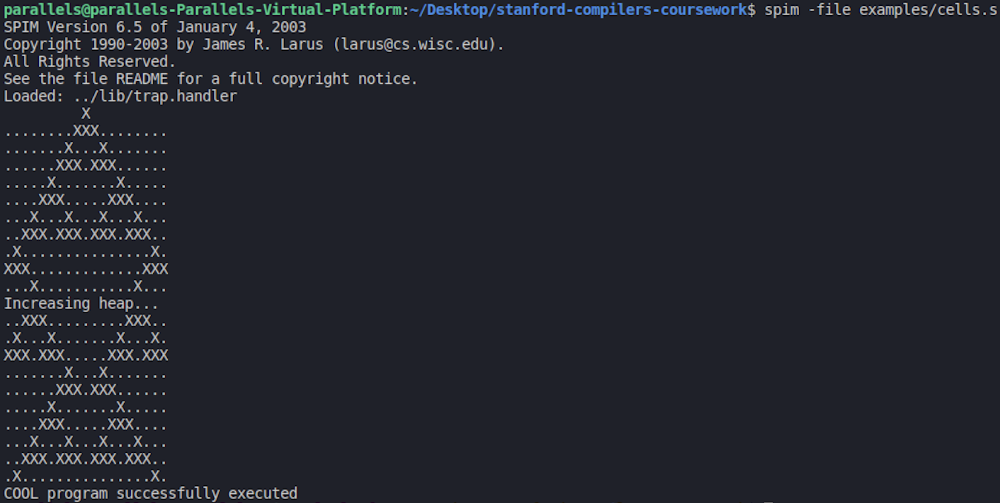

# Stanford Compilers Coursework - COOL Compiler
### Table of Contents

1. [Introduction](#introduction)
2. [Project structure](#project-structure)
3. [Testing and grading](#testing-and-grading)
4. [Sample COOL Programs](#sample-cool-programs)
5. [Setup & Reproduce](#setup--reproduce)
6. [Potential improvements](#potential-improvements)

## Introduction
This is a repository of coursework assignments for the [Stanford Compilers](https://online.stanford.edu/courses/soe-ycscs1-compilers) MOOC course.
The result of completing all coursework assignments is a fully-working compiler for the [COOL Programming Language](http://theory.stanford.edu/~aiken/software/cool/cool.html). Compiler is written in C++ and depends on several assignment supplied libraries (like symbol table, identifiers table ...). [Flex](https://github.com/westes/flex) and [Bison](https://www.gnu.org/software/bison) are used to implement first compiler frontend phases and other compiler passes are handcoded in C++.

The compiler compiles COOL into MIPS Assembly. MIPS is a reduced instruction set architecture about which you can learn more [here](https://en.wikipedia.org/wiki/MIPS_architecture).
Resulting programs are run using [SPIM simulator](http://spimsimulator.sourceforge.net/).

COOL (Classroom Object Oriented Language) is a computer programming language designed by Alexander Aiken for use in a compiler course taught at Stanford.
COOL resembles many modern programming languages, including features such as objects, automatic memory management, strict static typing and simple reflection.
COOL constructs take a few ideas taken from functional programming languages, so that every COOL statement is an expression which must return something.

COOL is precisely defined in specification documents, the most relevant ones are:
  * [COOL Manual](http://theory.stanford.edu/~aiken/software/cool/cool-manual.pdf)
    * describes lexical and syntactical structure of the language
    * describes type system rules (equations) and language operational semantics
  * [COOL Runtime System](https://theory.stanford.edu/~aiken/software/cooldist/handouts/cool-runtime.pdf)
    * describes the runtime system backing this programming language
    * describes garbage collection algorithms used and the interface between those and a correct compiler
    * describes the object layout recommended to implement this language and the interface to the garbage collection routines
    
 Here are a few examples of simple COOL programs:
 
 [Hello world](./examples/hello_world.cl)
 ``` cool
 class Main inherits IO {
   main(): SELF_TYPE {
	out_string("Hello, World.\n")
   };
};
 ```
 
 [Palindrome checking program](./examples/palindrome.cl)
 ``` cool
 class Main inherits IO {
    pal(s : String) : Bool {
	    if s.length() = 0 
          then true
	    else if s.length() = 1 
          then true
	    else if s.substr(0, 1) = s.substr(s.length() - 1, 1) 
          then pal(s.substr(1, s.length() -2))
	    else false
	    fi fi fi
    };

    i : Int;

    main() : Object {
      {
          i <- ~1;
          out_string("enter a string\n");
          if pal(in_string())
              then out_string("that was a palindrome\n")
              else out_string("that was not a palindrome\n")
          fi;
      }
    };
};

 ```
 
 ## Project Structure
 The compiler project consists of four programming assignments:
 * [Lexer](./assignments/PA2/cool.flex) - writing Flex specification which generates lexer
 	* The input to the lexer is a string and the output is a stream of tokens
 	* [Here](./handouts/PA2.pdf) is the assignment specification 
 * [Parser](./assignments/PA3/cool.y) - writing Bison specification which generates LALR(1) parser
  	* The input to the parser is a stream of tokens and the output is an abstract syntax tree
	* The abstract syntax tree is constructed using a simple syntax directed translation
 	* [Here](./handouts/PA3.pdf) is the assignment specification 
 * [Semantic Analyser](./assignments/PA4/semant.cc) - writing a pass for semantical analysis, mainly type checking
 	* The input to the semantic analyser is a raw abstract syntax tree and the output is the attributed abstract syntax tree
  	* [Here](./handouts/PA4.pdf) is the assignment specification 
 * [Treewalk Code Generator](./assignments/PA5/cgen.cc) - writing a pass for code generation using a naive treewalk algorithm, generating code for the 'stack machine')
 	* The input to the code generator is the attributed abstract syntax tree and the output is a file consisting of MIPS instructions
 	* [Here](./handouts/PA5.pdf) is the assignment specification 
	
## Testing and Grading
Most compiler phases are tested using the automated scripts which generate test cases and run each phase on the generated test cases. Almost all scripts were provided by the skeleton coursework project. All compiler phases are written and treated separately (ex: semantic analysis depends on the reference parser and lexer instead of ones written in this repository). This is to ensure that each phase generates only its own mistakes, since the mistakes made in previous phases could easily propagate in some later phase. 

In the last phase (code generator), reference lexer, parser and semantic analyser are replaced by the ones written in this repository since they have shown 100% accuracy, so it was reasonable to treat them as correct, although it may be wrong. There were precisely 270 test cases across all phases.
Complete testing report is available [here](https://github.com/gboduljak/stanford-compilers-coursework/blob/master/all-phases-test.out).

To reproduce it, simply run **run-all-phases-test.sh** in the root of repository. This script should (re)compile all phases, test them separately and link them into a compiler which will be tested as a whole executable.

## Sample COOL Programs
In the [examples](./examples) folder, there are various example COOL programs. All of them come in pairs ({name}.cl, {name}.s) where {name}.cl is a COOL program code, while {name}.s is the corresponding MIPS assembly program compiled using the written compiler (**coolc** in the root of the repository). 
Some of them are very simple and illustrate only key features of the COOL language, but there a few ones which are quite advanced (take a look at [lam.cl](./examples/lam.cl) which builds lambda calculus representation of a simple program and compiles it into Cool). 

One of the 'graphical' ones is [cells.cl](./examples/cells.cl) which models one dimensional cellular automaton.


All of these programs were provided in the skeleton course project. You can find more about them [here](./examples/README). 

## Setup & Reproduce
This setup has been tested on Ubuntu 18, but I assume it should work on many distros with somewhat different package installations.
The project depends on the reference COOL project and various tools. This setup is a variant of one discussed in the MOOC and the instructions written here originate from there.

1. Install packages: sudo apt-get install flex bison build-essential csh libxaw7-dev
2. Make the /usr/class directory: sudo mkdir /usr/class
3. Adjust directory permissions: sudo chown $USER /usr/class
4. Go to /usr/class and download the tarball
	* cd /usr/class
	* wget https://courses.edx.org/asset-v1:StanfordOnline+SOE.YCSCS1+1T2020+type@asset+block@student-dist.tar.gz
5. Untar
	* tar -xf student-dist.tar.gz
6. Add symlink to reference cool compiler stages 
	* ln -s /usr/class/cs143/cool ~/cool
7. Add the bin directory to the PATH environment variable
	* PATH=/usr/class/cs143/cool/bin:$PATH
8. Clone this repository
9. Run **compile-compiler.sh** in the root of this repository
	* This script should build all compiler stages separately and link them
	* You should be able to run compiler using ./coolc in the root of this repository
10. (Optionally) To ensure the compiler has been built successfully, execute **run-all-phases-test.sh** in the root of this repository
	* This script should test all compiler stages and output results similar to [all-tests-output](./all-phases-test.out)
	
## Potential improvements
